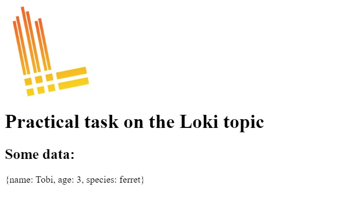

# Task on the topic Loki

Here we have a web application written in the [Go Echo framework](https://echo.labstack.com/). The task is to provide logging for the application, containerize it, and enable log aggregation using **Grafana Loki**. Please write a `Dockerfile` and configure the `docker-compose.yml` file. The services should be described as follows in the `docker-compose.yml` file:
- the service named `webapp` should run the application container
- the service named `grafana` should run the **Grafana** container

 Please make sure to include additional services if needed. When we run the command `docker compose up`,
 it should start the containers with the following functionality:
 - the web application that accessible on port `8080`:
 
 - **Grafana** that accessible on port `9090`
 - the configuration must define the label `webapp=varlogs` to filter the logs of our application

For example, when we query like `{webapp=varlogs}` in **Grafana**, it displays log information from our application:
 
